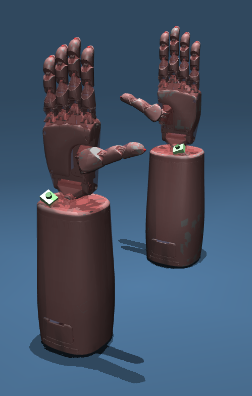

# Table of Contents

<toc>

[*Last generated: Fri Jul 17 2026*]
- [Table of Contents](#table-of-contents)
- [Pro-Models: Professional Hand Simulation Models](#pro-models-professional-hand-simulation-models)
  - [Overview](#overview)
  - [Model Structure](#model-structure)
  - [Collision Representations](#collision-representations)
    - [Convex Hull Representation](#convex-hull-representation)
    - [Capsule Hybrid Representation](#capsule-hybrid-representation)
  - [Quick Start](#quick-start)
    - [Installation](#installation)
    - [Running the Example Viewer](#running-the-example-viewer)
  - [Joint Configuration](#joint-configuration)
  - [Performance Considerations](#performance-considerations)
    - [Mesh Selection](#mesh-selection)
    - [Collision Detection](#collision-detection)
  - [Contributing](#contributing)
  - [License](#license)
  - [Citation](#citation)
  - [Support](#support)
  - [Related Projects](#related-projects)

</toc>


# Pro-Models: Professional Hand Simulation Models

A comprehensive collection of high-fidelity robotic hand simulation models for MuJoCo, featuring the ProHand 1D series (left and right) with multiple collision representations and optimized meshes.

|              Both Hand Example Demo               |
| :-----------------------------------------------: |
|  |

## Overview

This repository contains professional-grade robotic hand models designed for simulation and research applications:

- **ProHand 1D (Left Hand)**: 5-finger anthropomorphic hand on forearm with 20+ degrees of freedom
- **ProHand 1D (Right Hand)**: mirrored counterpart with matching kinematics
- (more versions rolling out ...)

Both models feature:
- **Finger Configuration**: 5 fingers (thumb, index, middle, ring, pinky)
- **Joint Structure**: 20+ degrees of freedom per hand (including 2 DOF wrist)
- **Collision Models**: Convex hull and capsule hybrid representations
- **Mesh Quality**: Both convex and optimized mesh variants
- **Applications**: Research, development, and simulation

## Model Structure

```
assets/
├── meshes/
│   ├── gen_1_D_L/                 # ProHand 1D (Left)
│   └── gen_1_D_R/                 # ProHand 1D (Right)
│       ├── convex/                # Convex hull meshes
│       └── optimized/             # Optimized detailed meshes
├── mjcf/
│   ├── gen_1_D_L/                 # MJCF configuration files
│   └── gen_1_D_R/                 # MJCF configuration files
│       ├── include_ASY__RIGHT_HAND_GEN1D_ON_FOREARM_GEN1D_convex_chain.xml
│       ├── include_ASY__RIGHT_HAND_GEN1D_ON_FOREARM_GEN1D_convex_config.xml
│       ├── include_ASY__RIGHT_HAND_GEN1D_ON_FOREARM_GEN1D_capsule_hybrid_chain.xml
│       └── include_ASY__RIGHT_HAND_GEN1D_ON_FOREARM_GEN1D_capsule_hybrid_config.xml
└── urdf/
    ├── gen_1_D_L/                 # URDF exports (convex, optimized)
    └── gen_1_D_R/                 # URDF exports (convex, optimized)
```

## Collision Representations

Each hand model provides two collision representation options:

### Convex Hull Representation
- **File Pattern**: `*_convex_*.xml`
- **Advantages**: Fast collision detection, suitable for real-time simulation
- **Use Cases**: Control development, real-time applications

### Capsule Hybrid Representation
- **File Pattern**: `*_capsule_hybrid_*.xml`
- **Advantages**: Faster and simpler collision detection, for contact-rich simulation
- **Use Cases**: Research, fast simulation, contact analysis

## Quick Start

### Installation
```bash
# Clone the repository
git clone <repository-url>
cd pro-models

# Install dependencies
pip install -r example/requirements.txt
```

### Running the Example Viewer

The repo ships with a [`justfile`](./justfile) for convenience. With [`just`](https://github.com/casey/just) installed:

```bash
just show_left_hand     # ProHand 1D (left)
just show_right_hand    # ProHand 1D (right)
just show_both_hands    # Both hands side-by-side
```

Or invoke the viewer directly:

```bash
# Linux
python3 example/hand_viewer.py {left|right|both}

# macOS (MuJoCo's passive viewer requires mjpython on macOS)
mjpython example/hand_viewer.py {left|right|both}
```

See [`example/README.md`](./example/README.md) for more details.

## Joint Configuration

Both hands feature similar joint structures:
- **Wrist**: 2 DOF (yaw, pitch)
- **Thumb**: 4 DOF (metacarpal, proximal, distal, trapezium)
- **Fingers**: 4 DOF each (metacarpal, proximal, middle, distal)

## Performance Considerations

### Mesh Selection
- **Convex Meshes**: ~50% faster simulation, suitable for real-time applications
- **Optimized Meshes**: Better visual quality, recommended for research and analysis

### Collision Detection
- **Convex Hull**: Fastest collision detection, good for control development
- **Capsule Hybrid**: More accurate contact modeling, better for research

## Contributing

We welcome contributions to improve the models, add new features, or enhance documentation. Please:

1. Fork the repository
2. Create a feature branch
3. Make your changes
4. Submit a pull request

## License

This repository uses a dual license:

- **Code, MJCF and URDF configuration files, and documentation** are released under the
  **BSD 3-Clause License** — free for academic, research, **and commercial** use. See
  [LICENSE.txt](./LICENSE.txt) for the full text.
- **Mesh geometry** (all `*.obj` and `*.stl` files under `assets/meshes/`) is
  **proprietary** — © Proception Inc., provided for evaluation and simulation
  of the ProHand series only. Using the geometry to reproduce a competing
  product, redistribution, modification-and-redistribution, and commercial
  use require prior written permission. See
  [MESHES-LICENSE](./MESHES-LICENSE) for the full terms.

For everything BSD-licensed, you may use, modify, redistribute, and build
products on top of it; the conditions are that the copyright notice and
disclaimer are preserved and that Proception's name is not used to endorse
derived products. The software is provided "as is", without warranty of any
kind.

We welcome research partnerships, commercial collaborations, and contributions.
Reach out at 📧 **contact@proception.ai**.

## Citation

If you use these models in your research, please cite:

```bibtex
@misc{pro_models_2025,
  title={Pro-Models: Proception Inc. Simulation Models for MuJoCo},
  author={Proception Inc., Jianxiang Xu, etc.},
  year={2025},
  url={https://github.com/Proception-AI/pro-models}
}
```

## Support

If you have questions, encounter issues, or would like to request a feature, feel free to open a GitHub issue.

## Related Projects

- **ProHand Gen1** — the physical hand these models represent. Product page: [proception.ai/product/pro-hand/gen1](https://www.proception.ai/product/pro-hand/gen1)

<eof>

---
[*> Back To Top <*](#Table-of-Contents) | © 2024-2026 Proception Inc. All rights reserved.
</eof>
